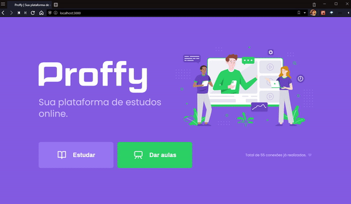

# Proffy - Web 

Proffy foi um projeto desenvolvido durante a Next level Week #2 promovido pela Rocketseat. 
A aplicação tem a proposta de conectar professores e alunos de uma maneira fácil e rápida.

## 💻 Preview
<h1 align="center">
    
</h1>

## 🚀 Tecnologias utilizadas
 - TypeScript
 - ReactJS

<h4 align="center">
    Made with 💜 by <a href="https://www.linkedin.com/in/ygor-thiago-farias-1111aa196/" target="_blank">Ygor Thiago Farias </a>
</h4>
